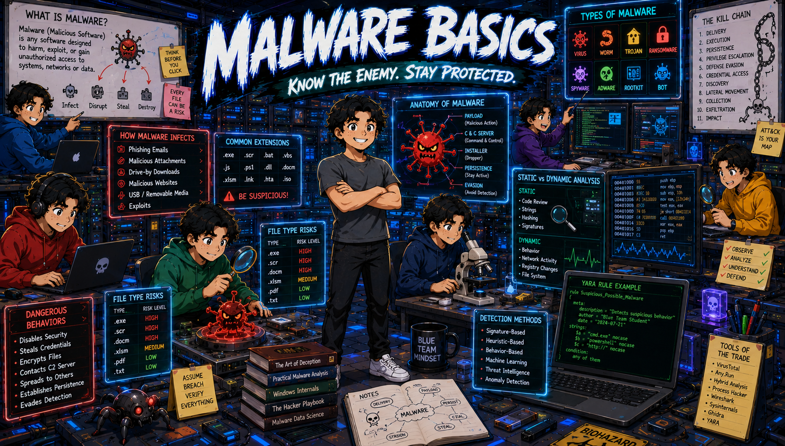

# 🔵 SOC Handbook
### A practical cybersecurity knowledge base for Security Operations Center professionals

*Focused on incident response, threat detection, Windows internals, and defensive security operations*

---

## 📋 Handbook Structure

### Security Domains & Topics

| | | | | |
|:---:|:---:|:---:|:---:|:---:|
|  |  |  |  |  |
| **🚨 Incident Response** | **🪟 Windows Internals** | **🔐 Active Directory** | **🌐 Networking** | **🎯 Threat Detection** |
| NIST Framework • Containment • Recovery | LSASS • Registry • Services | Kerberos • NTLM • GPO | DNS • DHCP • TCP/UDP • TLS | SIGMA Rules • Detection Logic • ATT&CK |

| | | | | |
|:---:|:---:|:---:|:---:|:---:|
|  |  |  |  |  |
| **🔎 DFIR** | **📊 SIEM** | **🦠 Malware Analysis** | **🐧 Linux** | **☁️ Cloud Security** |
| Memory Analysis • Timeline • Artifacts | Splunk • Elastic • Correlation | Persistence • Evasion • Behavioral | Hardening • Logs • Post-Exploitation | AWS • Azure • Security Posture |

| | | | | |
|:---:|:---:|:---:|:---:|:---:|
|  |  |  |  |  |
| **📍 MITRE ATT&CK** | **🛠️ Detection Engineering** | **📝 Cheat Sheets** | **🧪 Labs & Notes** | **💼 Interview Prep** |
| Tactics • Techniques • Mapping | Threat Intel • Build Logic • Rules | Quick Reference • Commands | Case Studies • Investigations | Common Questions • Deep Dives |

| | | | | |
|:---:|:---:|:---:|:---:|:---:|
|  |  |  |  |  |
| **↔️ Lateral Movement** | **📚 Basics** | **🎓 Foundations** | **🗺️ Roadmap** | **⚙️ Work in Progress** |
| AD Exploitation • Pivot Strategies | Core Concepts • Fundamentals | Core Knowledge • Deep Concepts | Learning Path • Progression | In Progress • Development |

---

## 🎯 Purpose

This is not a textbook. Each document is:

- **Practical** — Written from hands-on experience in the field
- **Concise** — Never exceeds 2 pages per topic
- **Connected** — Topics link to related concepts
- **Searchable** — Clear structure for quick reference during incidents

---

## 📖 How to Use This Handbook

### 1️⃣ Use as Reference During Investigations

Quick lookup for detection strategies, Windows artifacts, network protocols

### 2️⃣ Prepare for Job Interviews

Understand concepts deeply, not just memorize definitions

### 3️⃣ Build Detection Logic

Study MITRE mappings and detection examples

### 4️⃣ Learn Through Connections

Follow related topics to build solid mental models

---

## 📝 What Each Document Includes

Every topic covers:

- **Definition** — What is it and why does it exist?
- **Why It Matters** — Operational relevance in security
- **How It Works** — Technical explanation
- **Common Attacks** — Real-world exploitation
- **Detection** — Windows events, logs, SIEM queries
- **MITRE ATT&CK** — Tactic and technique mapping
- **Real Example** — Investigation case study
- **Related Topics** — Connected concepts for deeper learning
- **References** — Sources for further research

---

## 🔗 Getting Started

### For Beginners:
1. Start with **Basics** → Core security fundamentals
2. Move to **Incident Response** → NIST Framework
3. Then **Windows Internals** → LSASS & Registry
4. Build detection skills with **Threat Detection** → SIGMA Rules

### For Specific Investigations:
- **Lateral movement?** → Active Directory + Lateral Movement
- **Malware execution?** → Windows Internals + Malware Analysis
- **Data exfiltration?** → Networking + SIEM
- **Post-breach forensics?** → DFIR + Linux

---

## 📊 Learning Philosophy

> *"If you can't explain it with your own words after reading it once, you didn't understand it."*

Every concept here is written after closing references and explaining it from memory. 
This forces genuine understanding over passive reading.

---

## 🛠️ Contributing

This handbook grows with real investigations and hands-on labs.

### How to Contribute:
- 🍴 Fork this repository
- 📋 Create a branch: `feature/topic-name`
- ✍️ Follow the document template
- 🔗 Include references and real examples
- 📤 Submit a Pull Request

---

## 📊 Current Status

- 📚 **Completed Topics:** 15+ security domains
- 🚀 **In Progress:** Advanced DFIR, Supply Chain Defense
- 📋 **Planned:** Kubernetes Security, API Security

---

## ⚖️ Disclaimer

This is a personal knowledge base for defensive security operations. 
Use for educational and authorized security purposes only.

---

**Last Updated:** July 2026

Made with 🔵 for the Blue Team

---

# 📚 Topics

## Incident Response
NIST Framework, containment strategies, recovery procedures, root cause analysis

## Windows Internals
LSASS processes, Windows registry, services, authentication mechanisms, event logs

## Active Directory
Kerberos protocol, NTLM authentication, GPO management, lateral movement detection

## Networking
DNS fundamentals, DHCP protocol, TCP/UDP, TLS/SSL, packet analysis, network forensics

## Threat Detection
Detection engineering, SIGMA rules, MITRE ATT&CK mapping, detection logic building

## DFIR
Digital Forensics and Incident Response, memory analysis, timeline analysis, artifact collection

## SIEM
Log aggregation, Splunk, Elastic Stack, correlation rules, alerting strategies

## Malware Analysis
Persistence mechanisms, evasion techniques, behavioral analysis, IOCs extraction

## Linux
Linux hardening, log analysis, post-exploitation artifacts, system administration

## Cloud Security
AWS security, Azure security posture, cloud-native threats, cloud forensics

## MITRE ATT&CK
Framework overview, tactics, techniques, sub-techniques, enterprise matrix

## Detection Engineering
Building detections from threat intelligence, rule development, validation

## Cheat Sheets
Quick reference guides, command collections, common procedures

## Labs & Notes
Hands-on labs, investigation walkthroughs, case studies, practical exercises

## Interview Prep
Common SOC interview questions, technical deep dives, behavioral preparation

## Lateral Movement
Pivot techniques, AD exploitation, movement detection, pivot prevention

## Basics
Core security concepts, fundamentals, foundational knowledge

## Foundations
Advanced foundational knowledge, deep technical concepts

## Roadmap
Learning progression, skill development path, certification roadmap
